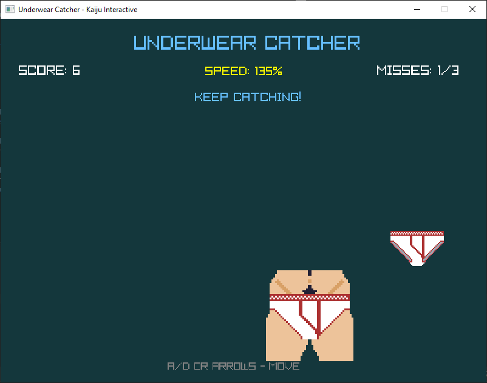

# 🩲 Underwear Catcher

Catch the undies. Don't let them hit the floor.

**Underwear Catcher** is a fast-paced arcade game developed by Kaiju Interactive in C# using raylib. Catch falling underwear, survive increasingly frantic drops, and chase your high score before three misses end the run.

## 🎮 Features

- Fast-paced arcade gameplay
- Multiple falling underwear types
- Increasing difficulty as the game progresses
- Three misses = game over
- Score and persistent high score tracking
- High score reset option
- Player sprite changes after the first catch
- Custom title and game-over screens
- Sound effects and original music
- Keyboard controls and quick restart

## 🛠️ Built With

- **C#**
- **raylib**
- **Visual Studio**

## 🎵 Original Music

Underwear Catcher features an original piano theme composed specifically for the game.

## 🚧 Project Status

**Released**

Underwear Catcher is a completed game and is available to download on itch.io.

## 🧠 What I Learned

Underwear Catcher was an opportunity to explore C# game development while building a complete arcade-style gameplay loop.

The project gave me experience with real-time input, collision detection, increasing difficulty, persistent high scores, audio, game-state management, sprite rendering, and packaging a finished game for release.

## 🎮 Play the Game

Underwear Catcher is available on itch.io:

[Play Underwear Catcher](https://kaiju-plays.itch.io/underwear-catcher)

## 👾 About

Developed by **Kaiju Interactive**.

I make weird games, experimental software, and occasionally things involving entirely too much underwear.
